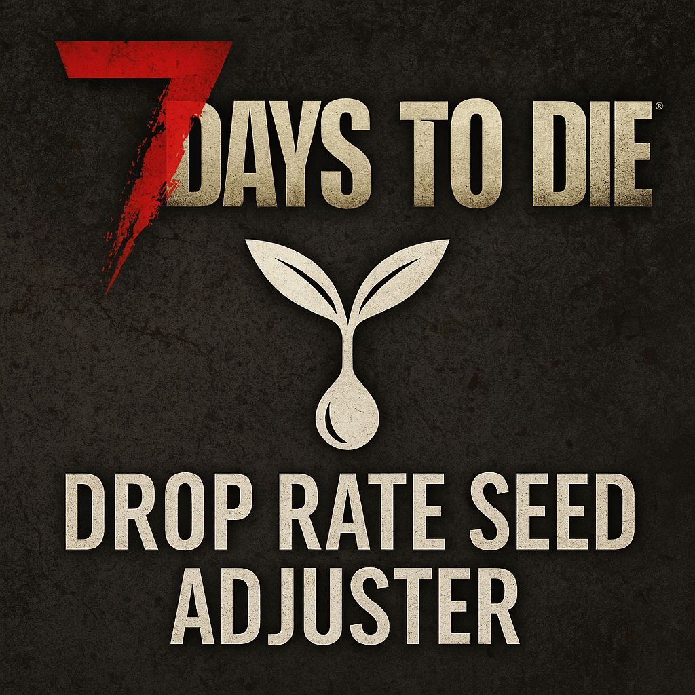

# Drop Rate Seed Adjuster (7 Days to Die Server Mod)

Diese Servermod für 7 Days to Die (Version 1.4b) passt die Drop-Rate von Baumsamen beim Holzabbau an.  

  

## 📦 Installation

1. Entpacke den Ordner `DropRateSeedAdjuster` nach `<server-root>/Mods/`  
2. Starte den Server neu  

**Alternative mit git:**  

1. Wechsel in den Mod ordner auf Deinem Server und gib ein:  
  `git clone https://github.com/realAscot/DropRateSeedAdjuster.git`  
  (`git` sollte bereits installiert sein `sudo apt install git`)  

## ⚙️ Funktion

Die Mod editiert `blocks.xml` und setzt individuelle Dropwahrscheinlichkeiten für:  

- Eichen-Samen  
- Kiefern-Samen  
- Birken-Samen  

## 🛠️ Kompatibilität

- Getestet mit Version **1.4b**  
- Keine Clientinstallation notwendig  
- Rein serverseitig (XML-Patch)  

## 📄 Changelog

## 📄 Roadmap

## 📄 Lizenz

Diese Mod steht unter der MIT-Lizenz. Sie darf frei verwendet, verändert und geteilt werden.  

